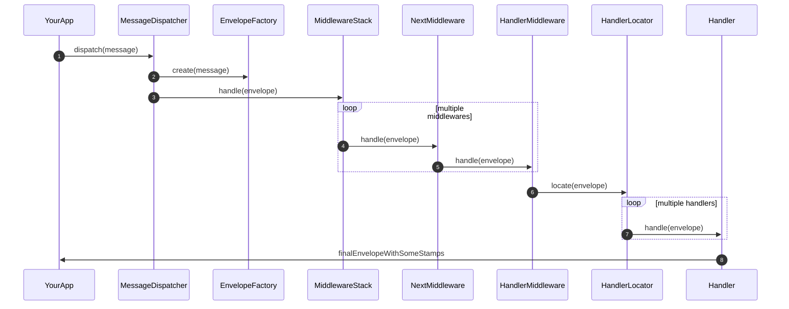

# PHP MiniBus: a minimal message bus

[](https://github.com/math3usmartins/php-minibus/actions/workflows/test.yaml)

**MiniBus** is a **minimal** and **framework-agnostic** message bus for PHP apps.

It was created to avoid unnecessary complexity as well as unnecessary
dependencies.

Therefore, it's perfect for modern apps and teams that value clean & simple
code.

Thanks to its [package design][1] and minimal requirements, `MiniBus` is
especially useful for legacy apps where **normally** modern packages are not
supported because of restrict PHP version or because their dependencies are
conflicting and can't be easily solved.

Don't be fooled though, `MiniBus` is a modern package as you'll see below.

## Inspiration

> the process of being mentally stimulated to do or feel something, especially
> to do something creative.

`MiniBus` is certainly inspired by [Symfony Messenger][2] and especially 
inspired by Matthias Noback's [Principles of Package Design][1].

`MiniBus` is also probably inspired by many other people, packages and work
experience that raised the need for a minimal and framework-agnostic message
bus.

Thank you all `\o/`

## Small and simple

As you should expect from a minimal and framework-agnostic package, `MiniBus`
is much more simple and small than other packages.

You can check the facts in a comparison with a couple other packages.

1. `symfony/messenger` v6.3.6 (core)
2. `simple-bus/message-bus` v6.3.1 (core)

**Relative Effort**

Thinking in terms of effort to understand, debug and maintain your app, the last
column shows the relative effort to use MiniBus.

> `Relative Effort = MiniBusMetrics / CompetitorMetrics`

**symfony/messenger**

p.s. metrics generated using [Sonarqube](https://github.com/SonarSource/sonarqube).

| Measure                         | MiniBus | Messenger | Relative effort |
|---------------------------------|---------|-----------|-----------------|
| Lines of code (LOC)             | 338     | 4600      | 7%              |
| Cyclomatic complexity           | 60      | 850       | 7%              |
| ....................... per LOC | 0.18    | 0.18      | 100%            |
| Cognitive complexity            | 12      | 760       | 1%              |
| ....................... per LOC | 0.03    | 0.16      | 19%             |

**notes**

Of course `symfony/messenger` is much more robust and that's the main reason
it's around `13` times bigger. But as shown in the cognitive complexity per LOC,
`symfony/messenger` is also relatively 5x more complex: `0.16` VS `0.03`.

It's true not all code of `symfony/messenger` is loaded into memory and executed,
and it certainly offers much more features and needs to consider many complex
scenarios, but in any case, that's why `MiniBus` exists: to avoid unnecessary
complexity.

Probably `symfony/messenger` could also benefit from a more minimal package
design.

**simple-bus/message-bus**

p.s. metrics generated using [Sonarqube](https://github.com/SonarSource/sonarqube).

| Measure                         | MiniBus | SimpleBus | Relative effort |
|---------------------------------|---------|-----------|-----------------|
| Lines of code (LOC)             | 338     | 459       | 73%             |
| Cyclomatic complexity           | 60      | 81        | 75%             |
| ....................... per LOC | 0.18    | 0.18      | 100%            |
| Cognitive complexity            | 12      | 37        | 32%             |
| ....................... per LOC | 0.03    | 0.08      | 37%             |

**notes**

Again `MiniBus` is smaller, but most relevant, it's still relatively much more
simple, with just `37%` of the cognitive complexity per LOC of `SimpleBus` with
`0.03` VS `0.08`. 

**CONCLUSION**

**In general, `MiniBus` is relatively much more simple than the other packages,
considering their cognitive complexity per LOC.**

However, it's interesting that they all have the same **cyclomatic complexity**
per LOC, but much different **cognitive complexity** per LOC.

What could explain that difference?! Why is `MiniBus` so much more simple in
terms of **cognitive complexity**?

It's time for the next topic...

## Fluent, functional and immutable

`MiniBus` offers some key differences compared to other packages:

1. it follows the [functional programming paradigm][3]
2. therefore components are heavily [immutable][4]
3. for convenience, components implement [Fluent Interface][5]

All of that makes the logic more natural, simple and easy to understand.

p.s. of course **mutation is required at some point**, but it's deferred as much
as possible.

p.s. [Fluent Interfaces][5] require a little additional **cyclomatic** complexity
in the classes where it's implemented. e.g. custom collections instead of array.
Despite that, the overall **cognitive** complexity is much smaller where it's
used.

**Comparison**

It's easy to see the difference by comparing a **specific case**: middleware
stack.

Take for example the [StackedMiddleware](src/Middleware/StackedMiddleware.php)
and [MiddlewareStack](src/Middleware/MiddlewareStack.php)
classes provided by `MiniBus` against the [StackMiddleware](https://github.com/symfony/messenger/blob/6.3/Middleware/StackMiddleware.php)
provided by Messenger.

| Measure                         | MiniBus | Messenger | MiniBus' Price |
|---------------------------------|---------|-----------|----------------|
| Lines of code                   | 50      | 54        | 93%            |
| Cyclomatic complexity           | 8       | 11        | 73%            |
| ....................... per LOC | 0.16    | 0.20      | 80%            |
| Cognitive complexity            | 3       | 8         | 37%            |
| ....................... per LOC | 0.06    | 0.14      | 43%            |

i.e. despite having almost the same size, the solution provided by `MiniBus`
is relatively much more simple and easy to understand: `0.06` VS `0.14`
cognitive complexity per LOC, thus `43%` of the price.

**note**

p.s. that's the total size and complexity of both `StackedMiddleware` and
`MiddlewareStack` provided by `MiniBus`.

## Package design

Following the [Principles of Package Design][1], `MiniBus` is composed by
multiple packages, each one targeting different goals or covering different
platform environments, so that your project isn't required to install packages
or extensions that are not really going to be used.

The core `php-minibus` package doesn't require any other package. But if your
project needs to integrate with RabbitMQ, then you need `amqp` extension and the
respective `php-minibus-amqp` package.

## Usage

```php
$dispatcher = new DefaultDispatcher(
    // you can implement your own envelope factory
    new BasicEnvelopeFactory(),
    // the DefaultDispatcher requires a stack
    new MiddlewareStack([
        // first middleware is executed first
        $loggerMiddleware = new LoggerMiddleware($logger),
        // next middleware MUST be called by previous one
        // via $next->handle($envelope)
        $handlerMiddleware = new HandlerMiddleware($handlerLocator)
    ])
);

$finalEnvelope = $dispatcher->dispatch(
    new BasicEnvelope(
        new MyAppMessage($someData),
        new StampCollection([
             new MyAppStamp($someData),
             new AnotherStamp($anotherData),
        ])
    ),
    $stampCollection
);
```

## The big picture



[1]: https://matthiasnoback.nl/book/principles-of-package-design
[2]: https://symfony.com/doc/current/components/messenger.html
[3]: https://en.wikipedia.org/wiki/Functional_programming
[4]: https://en.wikipedia.org/wiki/Immutable_object
[5]: https://martinfowler.com/bliki/FluentInterface.html

## Components

Learn more about components in their [specific documentation](docs/components.md).
